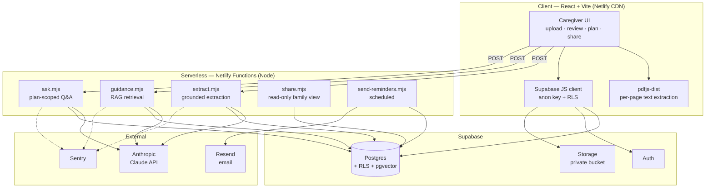
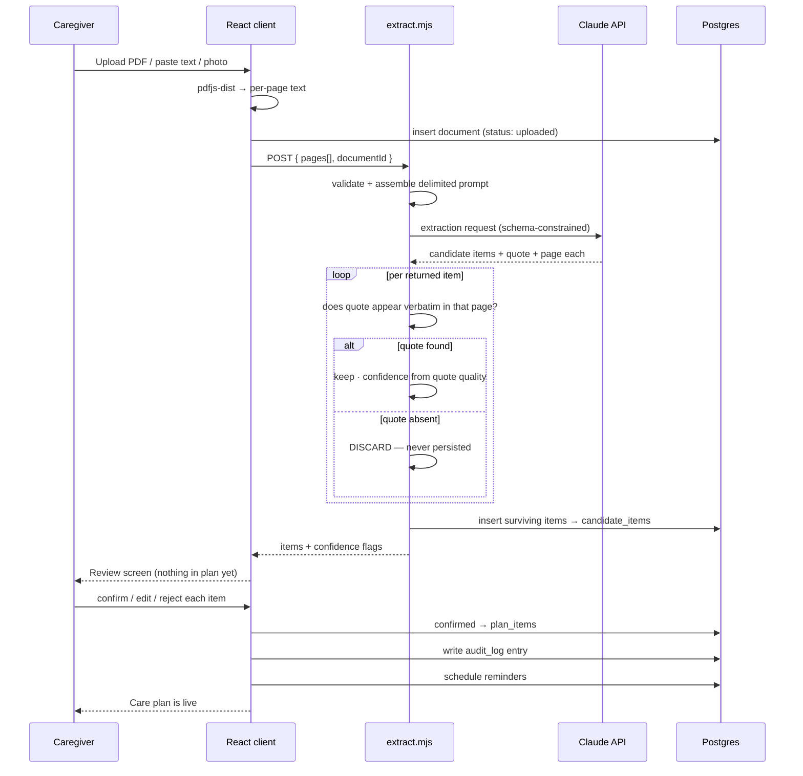
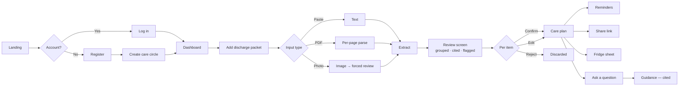
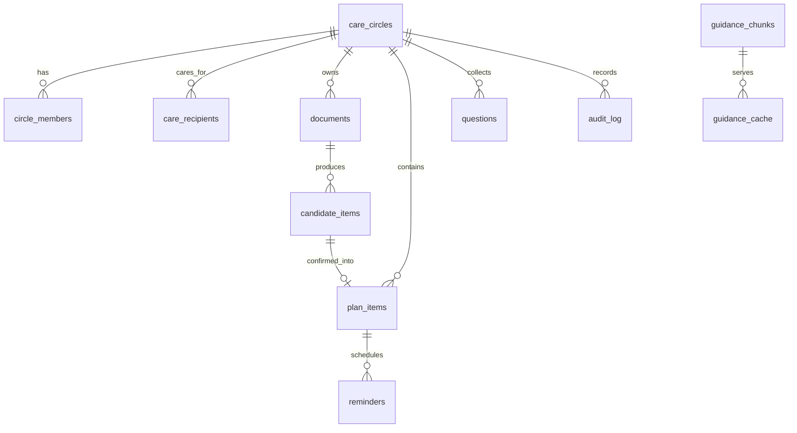
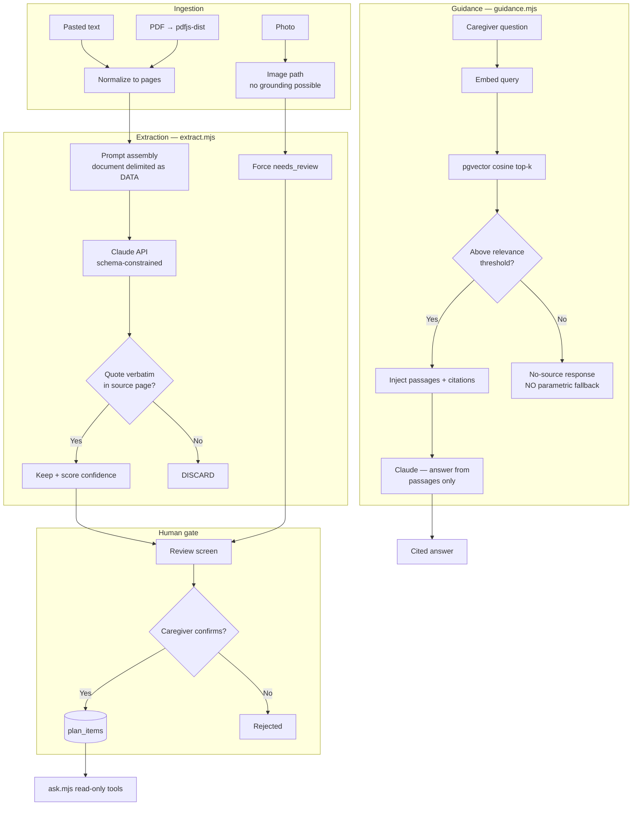
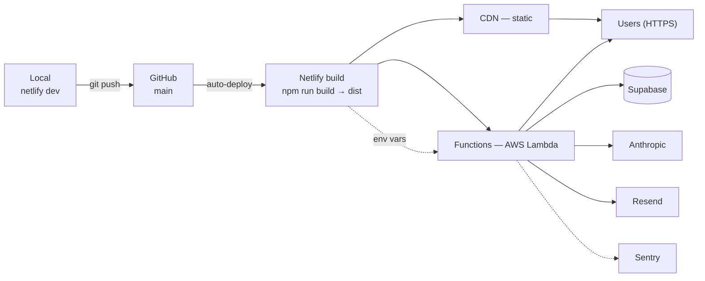

> **Note:** diagrams below use Mermaid, which GitHub renders natively in Markdown.

# Homecoming — Technical Design

**Builder:** Aryan Bhagat · Z23887703 · bhagata2025@fau.edu
**Companion document:** [`plan.md`](./plan.md)

---

## 1. System Architecture



**Boundary rule that shapes the whole architecture:** the browser never holds a key that costs money or bypasses authorization. The Anthropic key and the Supabase service-role key exist only inside Netlify Functions. The client gets the Supabase anon key, which is safe precisely because RLS enforces authorization in the database rather than in client code.

---

## 2. Data Flow — Document to Confirmed Plan



**The dashed line in this diagram is the product.** Everything above `candidate_items` is machine output. Nothing crosses into `plan_items` without a human action. That barrier is structural — enforced by separate tables and separate write paths — not a UI convention that a future refactor could erode.

**Image path divergence:** a photographed document produces no page text, so there is nothing to verify a quote against. Those items skip the grounding gate and are therefore **force-set to `needs_review`** with an explicit note that handwriting or photo capture cannot be verified. They cannot be bulk-confirmed. This was validated against a handwritten clinical note: the system read the content correctly *and* refused to claim confidence.

---

## 3. User Flow



### 3.1 Key Screen — Review

The review screen is where the product's thesis is either visible or invisible, so its layout is a design decision rather than an implementation detail.

Two panels. **Left:** the source document, page-navigable. **Right:** extracted items grouped by type — Medications, Appointments, Tasks, Warning Signs.

Every item card carries:

- The extracted content in plain language
- **A source citation ("p. 4") that scrolls the left panel to that page and highlights the supporting quote** — the caregiver can verify any claim in one click
- A confidence state: confirmed-ready, or **NEEDS REVIEW** with a specific reason ("the dosage here was unclear — please check page 4")
- Actions: Confirm · Edit · Reject

Items needing review are visually distinct and sort to the top. The caregiver's attention is directed at exactly the items where the machine is least reliable — which is the inverse of how most AI products present output, and is the direct answer to the ACL rubric's user-error-reduction criterion.

---

## 4. Database Schema



### 4.1 Tables

| Table | Purpose | Key columns |
|---|---|---|
| `care_circles` | A family unit. The authorization boundary for everything. | `id`, `name`, `created_by` |
| `circle_members` | Membership + role | `circle_id`, `user_id`, `role` (`owner`/`caregiver`/`viewer`) |
| `care_recipients` | The person being cared for | `id`, `circle_id`, `display_name` |
| `documents` | An uploaded packet | `id`, `circle_id`, `doc_type`, `storage_path`, `raw_text`, `content_hash`, `status` |
| `candidate_items` | **Unconfirmed AI output** | `id`, `document_id`, `item_type`, `content` (jsonb), `source_quote`, `source_page`, `confidence`, `needs_review`, `review_reason` |
| `plan_items` | **Human-confirmed plan** | `id`, `circle_id`, `candidate_item_id`, `item_type`, `content` (jsonb), `confirmed_by`, `confirmed_at`, `edited` |
| `reminders` | Scheduled notifications | `id`, `plan_item_id`, `due_at`, `notify_email`, `sent_at`, `status` |
| `questions` | Questions saved for the care team | `id`, `circle_id`, `text`, `source` |
| `audit_log` | Append-only record of every confirm/edit/reject/remove | `id`, `circle_id`, `actor`, `action`, `target`, `at` |
| `guidance_chunks` | RAG corpus | `id`, `source_url`, `source_title`, `text`, `embedding vector(1536)`, `retrieved_at` |
| `guidance_cache` | Query-hash cache | `query_hash`, `response`, `citations`, `expires_at` |

### 4.2 Why `candidate_items` and `plan_items` Are Separate Tables

The single most important schema decision. A `confirmed boolean` column on one table would have been simpler and would have been wrong: a bug, a bulk update, or a careless migration could flip that flag and silently promote unverified AI output into a care plan. Two tables with separate write paths make that class of error structurally impossible rather than merely unlikely.

### 4.3 Row Level Security

Every table carries RLS. The canonical policy shape:

```sql
create policy "circle members read"
  on plan_items for select
  using (
    circle_id in (
      select circle_id from circle_members
      where user_id = auth.uid()
    )
  );
```

Authorization lives in the database. A compromised or modified client cannot read another family's care plan, because the anon key carries no authority of its own.

### 4.4 Indexes

| Index | Reason |
|---|---|
| `candidate_items (document_id)` | Review screen loads all items for one document |
| `plan_items (circle_id, item_type)` | Dashboard grouping |
| `reminders (due_at) where sent_at is null` | Partial index — the scheduled function scans only unsent, due reminders |
| `circle_members (user_id)` | Hit on **every** RLS check; the hottest index in the system |
| `documents (content_hash)` | Duplicate-upload cache lookup |
| `guidance_chunks` HNSW on `embedding` | Vector similarity search |

---

## 5. API Architecture

All functions are `POST` to `/.netlify/functions/{name}` and return JSON. Auth is a Supabase JWT in the `Authorization` header; every function verifies it and derives circle membership server-side rather than trusting a client-supplied `circle_id`.

### `extract`

```jsonc
// Request
{ "documentId": "uuid",
  "pages": [{ "page": 1, "text": "..." }],
  "image": "base64 | null" }

// Response
{ "items": [{
    "id": "uuid", "itemType": "medication",
    "content": { "name": "Warfarin", "dose": "2.5 mg",
                 "schedule": "once daily", "status": "NEW",
                 "plainLanguage": "A blood thinner..." },
    "sourceQuote": "Warfarin 2.5 mg by mouth daily — NEW",
    "sourcePage": 4, "confidence": 0.94,
    "needsReview": false, "reviewReason": null }],
  "discarded": 2,     // failed grounding — surfaced, not hidden
  "tokensUsed": 3841 }
```

`discarded` is returned deliberately. A rising discard rate is a signal worth seeing, both in logs and during a demo.

### `guidance`

```jsonc
// Request
{ "query": "What does INR mean?", "planItemId": "uuid | null" }

// Response — grounded
{ "answer": "...", "sourced": true,
  "citations": [{ "title": "...", "url": "...", "excerpt": "..." }] }

// Response — no trusted source above threshold
{ "answer": "I don't have a trusted source for that. Please ask your care team.",
  "sourced": false, "citations": [],
  "offerAddToQuestions": true }
```

### `ask`

Plan-scoped Q&A with read-only tools: `get_plan_item`, `list_appointments`, `list_medications`, `search_guidance`. No tool can write. Responses cite the confirmed plan items they drew from.

### `share`

Generates and resolves a revocable read-only token for a family view. The shared view renders confirmed `plan_items` only — never `candidate_items`, so an unverified extraction can never reach a relative through a share link.

### `send-reminders`

Scheduled. Selects due unsent reminders via the partial index, sends through Resend, marks `sent_at`. Idempotent — a double invocation cannot double-send.

### Standard error shape

```jsonc
{ "error": { "code": "RATE_LIMITED",
             "message": "We're busy — retrying in a moment.",
             "retryable": true } }
```

Every error path returns JSON. This is enforced because an earlier plain-text error response broke client-side parsing and produced an unhelpful `SyntaxError` in the UI.

---

## 6. AI Component Architecture



### 6.1 The Two Safety Gates

**Gate 1 — grounding.** Model output must quote the source, and that quote must verifiably exist. This kills fabricated medications and invented dosages before persistence. It is a deterministic string check, not a model judging itself.

**Gate 2 — human confirmation.** Nothing becomes a care plan without a person saying so. This catches everything Gate 1 cannot: correctly-quoted but misinterpreted items, and anything arriving through the ungroundable image path.

Gate 2 also serves as the **prompt-injection defense**. A malicious document containing instruction-like text still has to produce something that survives quote verification *and* that a caregiver looks at and confirms as a real clinical item. Defense in depth arises from the product design rather than from prompt hardening alone.

### 6.2 Prompt Design Constraints

- Document content is delimited and explicitly labeled as untrusted data, never as instruction
- Output must conform to a strict JSON schema; malformed output is rejected and retried once
- The model is instructed to **restructure only** — no advice, no inference, no dosage suggestions, no triage
- Every item must carry its verbatim quote and page number, which is what makes Gate 1 possible

---

## 7. Deployment Architecture



| Concern | Configuration |
|---|---|
| Build | `npm run build` → `dist`; functions from `netlify/functions` |
| CI/CD | Push to `main` auto-deploys. Deploy previews on PRs. |
| Env vars | Netlify dashboard. `ANTHROPIC_API_KEY`, `SUPABASE_SERVICE_ROLE_KEY`, `RESEND_API_KEY` are function-scoped; only `VITE_SUPABASE_URL` and `VITE_SUPABASE_ANON_KEY` reach the client. |
| SPA routing | `netlify.toml` redirect `/*` → `/index.html` (200) |
| Scheduled | `send-reminders` on a Netlify scheduled-function cron |
| Rollback | Netlify keeps every deploy; one-click revert to any prior build |
| Container | `Dockerfile` + `docker-compose.yml` for reproducible local dev against local Supabase. Not the production path — stated plainly rather than overclaimed. |

---

## 8. Rationale for Major Technical Decisions

### Tech stack — React + Vite + Netlify Functions

Chosen for **demonstrated velocity**: this is the same stack used to ship PaperShelf, so no build-tooling time is spent learning. Netlify Functions keep the AI key server-side without operating a server. Vite's dev server plus `netlify dev` gives a local environment that matches production closely.

*Trade-off accepted:* serverless cold starts add latency to the first request. Irrelevant here, because extraction is already a multi-second operation with progress states.

### Database — Supabase over Firebase

Firebase was the alternative and was used on a prior project. Supabase won on three grounds specific to this application:

1. **Row Level Security in Postgres** expresses "members of a care circle can read that circle's data" as a declarative policy at the data layer. The equivalent in Firestore rules is harder to reason about and easier to get subtly wrong — and the cost of getting it wrong is one family reading another's medical information.
2. **Relational integrity.** The candidate → plan → reminder lifecycle is genuinely relational. Foreign keys and joins are the right tool; document denormalization would have been fighting the data.
3. **`pgvector` is built in**, so the RAG layer needs no additional service.

### AI model — Anthropic Claude

Strong structured-output adherence, which the schema-constrained extraction depends on, and reliable instruction-following on the "restructure only, never advise" constraint — the safety-critical requirement. Long context handles multi-page packets in one call. Vision on the same API covers photographed documents without a second provider.

### Vector store — `pgvector`, not Pinecone/Weaviate/Chroma

At a corpus in the low thousands of chunks, a dedicated vector database adds a service, a credential, a failure mode, and a bill in exchange for performance that is not needed at this scale. Keeping embeddings in Postgres means one database, one backup, one RLS model. **The right answer changes at a different scale, and this decision is documented so it can be revisited rather than inherited.**

### Cache — Postgres, not Redis

Same reasoning. The cached objects are guidance answers and document hashes — low write volume, TTL-based expiry, tolerant of millisecond-range latency. A Postgres table with an `expires_at` column serves this correctly. Redis would be infrastructure added for its own sake.

### Auth — Supabase Auth

Bundled with the database, which is what makes `auth.uid()` usable directly inside RLS policies. Introducing a third-party identity provider would mean bridging identity into Postgres before any policy could reference it — added complexity for no gain at this scale.

### Deployment — Netlify

Zero-config Git-based CD, functions and static hosting in one place, automatic HTTPS, instant rollback, and a free tier that keeps the affordability story credible for the ACL submission.

### Email — Resend

Simple API, generous free tier, straightforward domain verification. Email over SMS because email has no per-message cost and no carrier compliance surface, which matters for a project scored partly on affordability.

---

## 9. Open Design Questions

Recorded honestly rather than omitted:

1. **OCR for photographed documents.** Tesseract.js would produce text that grounding could verify — but OCR errors would then be grounded against OCR output rather than the true document, which risks *false confidence*. The current force-review posture may be the more honest design even after OCR ships. Unresolved.
2. **FHIR export.** Named in the ACL metrics criterion and tied to a separate meritorious prize. Genuinely valuable, genuinely out of MVP scope. Attempted only if Weeks 8–9 close early.
3. **Multi-document longitudinal view.** A second admission should merge into an existing plan rather than create a parallel one. Correct behavior, unclear scope. Deferred.
4. **Confidence calibration.** Confidence currently derives from quote-match quality. Whether that correlates with actual correctness is measurable — and the caregiver-interview and edit-rate data from Week 9 is the way to test it.
